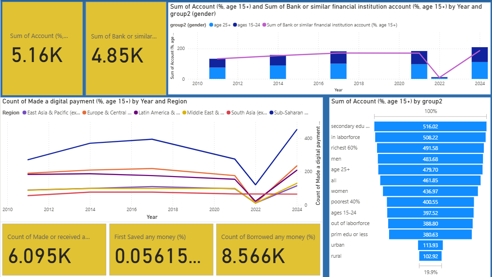

# Discussion

## Key Dimensions of Financial Inclusion 

This dashboard does a great job of pulling together the key aspects of financial inclusion. It shows how things like account ownership, digital payments, saving habits, and borrowing trends differ depending on region, age, and gender. That kind of breakdown really helps highlight where the gaps are and makes it easier to spot trends that are important.

### Few key takeaways during the analysis

Account ownership has definitely grown over time from 2011 to 2025 with noticeable jumps in places like Sub-Saharan Africa and South Asia. It's clear that financial services are reaching more people, slowly but surely.

The gender gap still exists, though there’s some good news. Men still tend to have more accounts than women, but in a few regions, that gap is starting to close. Progress, but uneven.

Digital payments are really taking off in areas like East Asia & Pacific and Europe & Central Asia. That said, regions like Sub-Saharan Africa and especially rural populations are still lagging behind when it comes to digital adoption.

Savings and borrowing habits differ a lot depending on income. Wealthier groups (top 60%) are more likely to save, while poorer households often rely on informal borrowing. Not ideal, but not surprising either.

Education and work status seem to play a huge role. People with at least secondary education, or who are active in the labor force, are far more likely to have an account.

Overall, we’re seeing movement toward broader financial inclusion, but the picture isn’t entirely rosy. Gaps still exist especially for women, low-income groups, and rural communities. If the goal is truly universal access, targeted policies will be key to removing the specific barriers these groups face.

