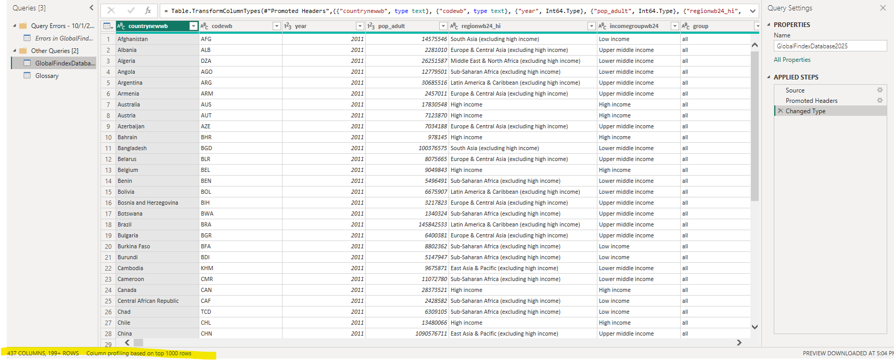
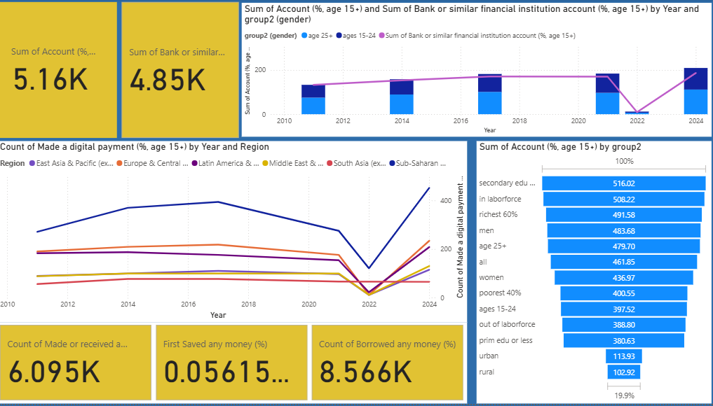

# Zaya's notes for writing final report 

> `Financial inclusion:` Individuals and businesses have access to affordable financial products and services (like bank accounts, savings, credit, and digital payments) and can use them effectively

- **It’s often measured by:**
    - **Access** → Do people have an account at a bank or mobile money service?
    - **Usage** → Do they use those accounts for payments, savings, borrowing?
    - **Quality/Barriers** → What stops people from accessing finance (cost, trust, documentation, distance)?

- **Why It Matters:**
    - For individuals: improves ability to save, borrow, smooth income, invest in education/health.
    - For society/economy: linked to poverty reduction, digital transformation, and economic growth.
    - For policy: helps governments target vulnerable groups (e.g., women, rural poor).

## How to start the analysis? Thinking workflow to achieve this project
1. Explore Dataset First 
2. Brainstorm possible angles
3. Choose one research question
4. Select Key Variables
5. Build Dashboard

## Note 1

- Rows: 199
- COls: 437

I used Column quality, Column distribution, Column profile while transforming data.

Identified categorical:
    - region
    - income groups

### Metadata:
- country
- codewb
- year
- region
- income

1. error shows when i load the data
    > this because. 
    - The Global Findex dataset has hundreds of columns (438+ in your case).
    - Some columns mix numbers and text (e.g., ".." for missing data, or categories in what should be numeric columns).
    - Power BI auto-detects data types → mismatches become “Errors”.

    > fixed solution
    - If categorical (like “High income”) → set to Text.
    - If numeric but with some text (like "..") → use Replace Values to clean, then set type = Decimal/Whole Number.
    - Delete the auto-generated “Errors in GlobalFindexDatabase2025” query — you don’t need it once the main query is clean.

    **report**
    `“Some columns contained mixed data types (e.g., numeric values with placeholders such as ..). These were cleaned in Power BI by replacing invalid entries with nulls and standardising column types to numeric or text as appropriate.”`

2. There are many NA when I carefully check all comuns in data view 
    - ``
2. glossary usage as headers of datasets

    - **report:**
    `“It is strongly encouraged to create a data dictionary (an explanation of each variable) to do so.”`

3. draft dashboard

## 2nd(10/7) meeting minutes of the team BI-GROUP-PROJECT:
done: data clean
done: select the important 

- Discuss and Agree on the research question 
	- Huang: make it more specific more answereable questions. Gender gaps
	- How did account owernership and digital payment use change from 2011 to 2025 across regions and income groups, and where do gender gaps persist or narrow
- Task allocation 
- Zaya will share the datasets and dashboard. 

