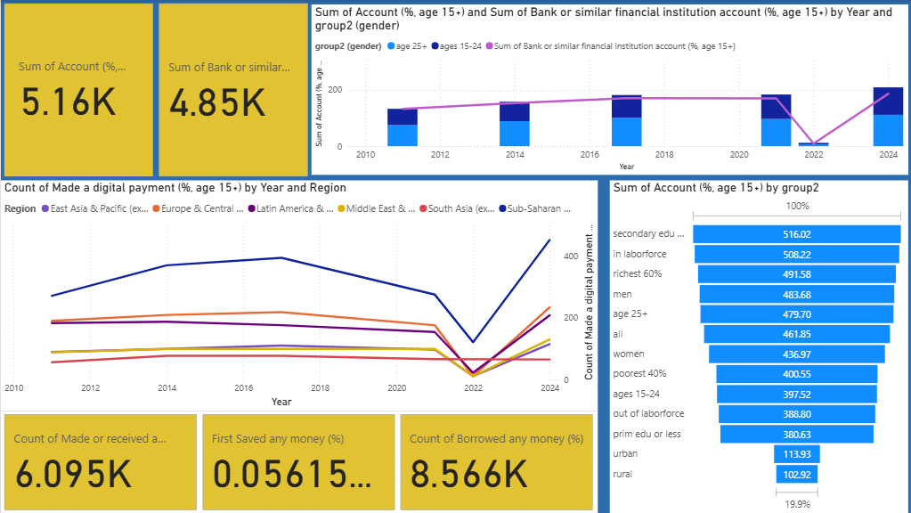

# INMT5526: Business Intelligence – Group Report
- **Dataset:** World Bank Global Findex Database 2025  
- **Group Members:** Group of 4 members
    - Erdenezaya Batnasan (24448191)
    - Stream Huang (23011392)
    - Gideon Tan (24578622)
    - Jinshu Zhang (23773086)
## Table of Contents

- [1. Introduction](#1-introduction)
    - [Purpose of the Report](#purpose-of-the-report)
    - [Importance of Financial Inclusion](#importance-of-financial-inclusion)
    - [Overview of Approach](#overview-of-approach)
- [2. Background](#2-background)
  - [2.1 Dataset Overview](#21-dataset-overview)
  - [2.2 Literature Review](#22-literature-review)
    - [**Definition of Financial Inclusion**](#definition-of-financial-inclusion)
    - [**Dimensions and Measurement of Financial Inclusion**](#dimensions-and-measurement-of-financial-inclusion)
    - [**Digital Inclusion**](#digital-inclusion)
    - [**Financial Access**](#financial-access)
    - [**Financial Behavior**](#financial-behavior)
  - [2.3 Research Question(s)](#23-research-questions)
- [Methodology](#methodology)
  - [Data Preparation and Cleaning](#data-preparation-and-cleaning)
    - [**Field Standardisation**](#field-standardisation)
    - [**Handling Missing Data**](#handling-missing-data)
    - [**Variable Selection and Reduction**](#variable-selection-and-reduction)
    - [**Transformation Workflow**](#transformation-workflow)
- [Solution](#solution)
- [Discussion](#discussion)
  - [Key Dimensions of Financial Inclusion](#key-dimensions-of-financial-inclusion)
    - [Few key takeaways during the analysis](#few-key-takeaways-during-the-analysis)
- [References](#references)
- [Appendix](#appendix)

# 1. Introduction
For this project, we’re diving into the World Bank’s Global Findex 2025 data to take a closer look at financial inclusion around the world. Our goal? To dig into a few research questions (suggested by our group) and find out what the numbers actually tell us.

- like the gender gap in access to financial services.
- digital device mobile 
- salary across the world

We’re kicking things off by cleaning and transforming the data in Power BI. After that, we’ll zero in on a few key indicators that show meaningful trends—things like differences across countries, regions, and income levels.

Next up: building an interactive dashboard that helps us (and others) spot those patterns and explore the data more easily.

We’re also putting together a report to explain what we did, what we found, and why it matters. To keep things clear, we added a few extras in the appendix—like a data dictionary and some dashboard screenshots—so everything’s easy to follow.

The workflow of group projects:
- Explore dataset → shortlist variables.
- Define storyline / research question, focus.
- Clean dataset & rename key columns.
- Build visuals in Power BI.
- Draft report sections in Markdown.
- Merge, polish, and export PDF.
- Submit deliverables.

### Purpose of the Report
Explain the goals of the assignment and why financial inclusion matters globally.

### Importance of Financial Inclusion
- Role in economic development  
- Relevance for policymakers and organisations  

### Overview of Approach
- Dataset: World Bank Global Findex 2025  
- Tool: Power BI Desktop  
- Deliverables: Dashboard + Report  

✍️ *Contributor: Zaya*

# 2. Background

## 2.1 Dataset Overview
The Global Findex Database is the world’s only demand-side survey on financial inclusion and a leading source of data on how adults access and use financial services. The 2025 edition, its fifth, introduces the Global Findex Digital Connectivity Tracker, the world’s first globally comparable demand-side dataset on mobile phone ownership and internet use, and their contribution to financial inclusion.
 
This project’s analysis is built on the World Bank’s Global Findex Database (2025) a huge source of survey data that looks at financial inclusion and how people use financial services around the world. The dataset includes thousands of responses from individuals in different countries, and it covers a wide range of variables related to things like:

- **Financial Behavior** – `Save_Any`, `Borrow_Any`, `Saved_At_Bank_Using_Mobile`  
- **Financial access** –  `Account`, `Fiaccount`, `Debit_Card`  
- **Regional/temporal dimensions** – `country`, `region`, `year of survey`.  
- **Financial Application Usage** - `Utility_Payment`, `Emergency_Fund30d`
- **Demographics** – `age`, `gender`, `education`, `income quintiles`.

Each column in the dataset maps to a survey question or a classification variable, and every row represents either an individual response or a rolled-up summary. There's a ton of depth here, which means we can look at the basics like averages and percentages but also dig into comparisons across different countries and groups.  

As the only global source of comparable demand-side data, the Global Findex enables cross-country and cross-regional analysis of how adults use mobile phones, the internet, and financial accounts to access digital information, save, borrow, make payments, and manage their financial well-being.

---

## 2.2 Literature Review

### **Definition of Financial Inclusion**
Financial inclusion refers to the access to and use of formal financial services by households and firms. According to the IMF (2015), financial inclusion serves as a policy tool to improve livelihoods, reduce poverty, and promote economic development. Similarly, the BIS (2015) defines it as access to and usage of financial services that meet users’ needs in a sustainable and responsible manner.

### **Dimensions and Measurement of Financial Inclusion**
Numerous studies and international organizations have developed frameworks to measure financial inclusion. Allen et al. (2016) explored the individual and country-level determinants of financial inclusion, focusing on financial access, financial use, and the barriers or costs that hinder participation. They argue that account ownership and account usage represent the core indicators of financial inclusion, as they directly reflect individuals’ ability to engage with formal financial institutions. The OECD (2022), in its Toolkit for Measuring Financial Literacy and Financial Inclusion, emphasized that the measurement of financial inclusion should consider multiple aspects, including access, usage, and behavioral or attitudinal components such as financial knowledge and attitudes toward money management. Sharma and Changkakati (2022) examined financial inclusion using three key dimensions—access, usage, and quality—and linked these to the United Nations Sustainable Development Goals (SDGs), highlighting the broader role of inclusion in achieving equitable growth. In addition, the G20 Financial Inclusion Indicators (2015) framework explicitly defines three dimensions of financial inclusion: access to financial services, usage of financial services, and the quality of products and service delivery. Taken together, these frameworks provide a coherent view that financial inclusion can be conceptualized through three main dimensions: access, usage, and enabler (or quality).
In the 2025 Global Findex dataset, there is a particular emphasis on digital financial inclusion, reflecting the growing importance of digital connectivity in promoting financial participation. The dataset highlights variables such as mobile phone ownership and internet use, which represent the digital access and usage aspects of inclusion. Therefore, this study conceptualizes financial inclusion as a three-dimensional construct comprising digital inclusion, financial access, and financial behavior. These dimensions represent the progressive stages of inclusion—from the availability of digital tools, to access to formal financial services, and finally, to active engagement in financial activities.

### **Digital Inclusion**
According to the OECD (2021), digital inclusion encompasses both digital access — the availability and affordability of ICT — and digital use, referring to the ability and frequency of engaging with digital tools. The ITU (2022) further highlights that digital access and digital use are the two key pillars of digital inclusion and readiness. Jia and Kanagaretnam (2024) examined the ethical and social dimensions of digital inclusion and found that it plays a critical role in advancing financial inclusion, especially in vulnerable and underserved regions. Their findings suggest that digital inclusion empowers financial service providers and other stakeholders to better fulfill their ethical and social responsibilities toward marginalized populations.

### **Financial Access**
As discussed by Birkenmaier et al. (2019), financial access broadly refers to the ability of all individuals to obtain and use safe, affordable, and appropriate financial products and services. It promotes financial well-being at both household and societal levels by ensuring access to instruments such as savings accounts, credit cards, mortgages, and loans. However, many people remain unbanked or underbanked, relying on alternative financial services, which hinders full financial inclusion.

### **Financial Behavior**
Financial behavior reflects the attitudes and actions individuals take in managing their finances — including budgeting, spending, saving, investing, and financial planning. Previous research shows that positive perceptions of electronic payments can significantly enhance behavioral intentions and foster greater financial inclusion. Overall, financial behavior demonstrates how individuals plan for the future, control their expenditures, and build saving habits that influence long-term financial decision-making and well-being.

## 2.3 Research Question(s)
For this project, we will investigate the following questions:

- How did account owernership and digital payment use change from 2011 to 2025 across regions and income groups, and where do gender gaps persist or narrow?
  **Research Focus:**
     - How does regions, income groups, and gender gaps and period of time (years) = x variables influence account ownership (y variable)
     -  How does regions, income groups, and gender gaps and period of time (years) = x variables influence digital payment use (y variable)"

These questions tie directly into the unit’s learning goals, and they’ll help shape how we build the dashboard and make sense of the results later on.

✍️ *Contributor: Zaya, Jinshu*

# Methodology

## Data Preparation and Cleaning

We brought the Global Findex 2025 CSV from the LMS into Power BI Desktop and did all the prep work using Power Query. Following the World Bank’s official glossary, we cleaned up and standardized the variable names, made sure data types were consistent, and trimmed the dataset to keep only what mattered for our research. That meant focusing on things like account ownership, digital payments, savings, borrowing, and key demographic info.

### **Field Standardisation**
To make things easier to understand and keep things consistent with previous survey waves; we replaced the confusing column headers with names that actually make sense. Here's how we renamed them:

| Original Field | New Field Name   | Description |
|----------------|------------------|--------------|
| `countrynewwb` | **Country**      | Country name |
| `codewb` | **Country_Code** | ISO/World Bank country code |
| `year` | **Year** | Survey wave year |
| `pop_adult` | **Adult_Population** | Adult population (15+) |
| `regionwb24_hi` | **Region** | World Bank region |
| `incomegroupwb24` | **Income_Group** | World Bank income classification (Low, Lower-middle, Upper-middle, High) |
| `con1` | **Own_Mobile_Phone** | Respondent owns a mobile phone |
| `account_t_d` | **Account** | Has any financial account (bank or mobile money) |
| `fiaccount_t_d` | **Fiaccount** | Has an account at a financial institution |
| `fin2_t_d` | **Debit_Card** | Owns a debit card |
| `fin24aP` | **Emergency_Fund30d** | Can raise emergency funds within 30 days |
| `borrow_any_t_d` | **Borrow_Any** | Borrowed from any source in the past 12 months |
| `save_any_t_d` | **Save_Any** | Saved money in the past 12 months |
| `fin30` | **Utility_Payment** | Made a utility payment |
| `fin17a_17a1_d` | **Saved_At_Bank_Using_Mobile** | Saved using an account or mobile platform |

### **Handling Missing Data**
The raw data used "NA" and blank fields for non-responses. In Power Query, we swapped out all "NA" entries for actual nulls; we didn’t impute anything just to avoid messing with data types or skewing any results. Since the survey coverage isn't the same across every country and year, we treated these nulls as real missing values, not zeros.
Later on, we used tooltips and summary cards in the dashboard to help users see where the data was patchy.

### **Variable Selection and Reduction**
To align with our research focus, changes in account ownership and digital financial usage across regions and income groups with a gender-gap.  We retained the following variables:
- Core classification fields: *Country, Country_Code, Year, Region, Income_Group, Adult_Population*  
- Key inclusion indicators: *Account, Fiaccount, Utility_Payment, Save_Any, Borrow_Any, Own_Mobile_Phone, Debit_Card*  

Redundant grouping fields (`group`, `group2`) and sparsely populated variables unrelated to our analysis were removed to improve model clarity and Power BI performance.

### **Transformation Workflow**
We kept track of all the changes in Power Query’s Applied Steps pane so everything’s easy to follow and repeat later.
Once we finished cleaning the data, we hit Close & Apply to bring it into Power BI’s model layer.

From there, we created a few key measures for analysis, like:

- Averages for percentage-based indicators,
- Year-over-year changes, and
- Gender gaps (measured in percentage points).

This setup gave us a clean, transparent workflow—everything’s right there in the `assign.pbix` file and ready to go.

✍️ *Contributor: Stream Huang*

# Solution

# Discussion

## Key Dimensions of Financial Inclusion 

This dashboard does a great job of pulling together the key aspects of financial inclusion. It shows how things like account ownership, digital payments, saving habits, and borrowing trends differ depending on region, age, and gender. That kind of breakdown really helps highlight where the gaps are and makes it easier to spot trends that are important.

### Few key takeaways during the analysis

Account ownership has definitely grown over time from 2011 to 2025 with noticeable jumps in places like Sub-Saharan Africa and South Asia. It's clear that financial services are reaching more people, slowly but surely.

The gender gap still exists, though there’s some good news. Men still tend to have more accounts than women, but in a few regions, that gap is starting to close. Progress, but uneven.

Digital payments are really taking off in areas like East Asia & Pacific and Europe & Central Asia. That said, regions like Sub-Saharan Africa and especially rural populations are still lagging behind when it comes to digital adoption.

Savings and borrowing habits differ a lot depending on income. Wealthier groups (top 60%) are more likely to save, while poorer households often rely on informal borrowing. Not ideal, but not surprising either.

Education and work status seem to play a huge role. People with at least secondary education, or who are active in the labor force, are far more likely to have an account.

Overall, we’re seeing movement toward broader financial inclusion, but the picture isn’t entirely rosy. Gaps still exist especially for women, low-income groups, and rural communities. If the goal is truly universal access, targeted policies will be key to removing the specific barriers these groups face.

# References

Allen, F., Demirguc-Kunt, A., Klapper, L., & Martinez Peria, M. S. (2016). The Foundations of Financial inclusion:
    Understanding Ownership and Use of Formal Accounts. Journal of Financial Intermediation, 27(1), 1–30. https://doi.org/10.1016/j.jfi.2015.12.003

Birkenmaier, J., Despard, M. R., Friedline, T., & Huang, J. (2019). Financial Inclusion and Financial Access. 
    https://  doi.org/10.1093/acrefore/9780199975839.013.1331

G20 Financial Inclusion Indicators | DataBank. (2015). Worldbank.org. https://databank.worldbank.org/source/g20-financial-inclusion-indicators

Gottschalk, F., & Weise, C. (2023). Digital equity and inclusion in education. OECD Education Working Papers, 299.      
    https://doi.org/10.1787/7cb15030-en
    
Jia, X., & Kanagaretnam, K. (2024). Digital Inclusion and Financial Inclusion: Evidence from Peer-to-Peer Lending. Journal of Business Ethics. https://doi.org/10.1007/s10551-024-05689-w

Khawar, S., & Sarwar, A. (2021). Financial literacy and financial behavior with the mediating effect of family financial socialization in the financial institutions of Lahore, Pakistan. Future Business Journal, 7(1). https://doi.org/10.1186/s43093-021-00064-x

Klapper, L., Singer, D., Starita, L., & Norris, A. (2025). The Global Findex Database 2025: Connectivity and Financial 
    Inclusion in the Digital Economy. In Washington, DC: World Bank eBooks. World Bank Group. https://doi.org/10.1596/978-1-4648-2204-9
    
Mehrotra, A., & Yetman, J. (2015). Financial inclusion - issues for central banks. Www.bis.org. https://www.bis.org/publ/qtrpdf/r_qt1503h.htmOECD. (2022). 

OECD/INFE Toolkit for Measuring Financial Literacy and Financial Inclusion 2022. OECD. https://www.oecd.org/en/publications oecd-infe-toolkit-for-measuring-financial-literacy-and-financial-inclusion-2022_cbc4114f-en.html

Sahay, R., Cihak, M., N’Diaye, P., Barajas, A., Mitra, S., Kyobe, A., Mooi, Y., & Yousefi, R. (2015). Financial 
    Inclusion: Can it Meet Multiple Macroeconomic Goals? Staff Discussion Notes, 15(17), 1. https://doi.org/10.5089/9781513585154.006

Selvia, G., Rahmayanti, D., Afandy, C., & Zoraya, I. (2021). The Effect of Financial Knowledge, Financial Behavior and Financial Inclusion on Financial Well-being. Proceedings of the 3rd Beehive  International Social Innovation Conference, BISIC 2020, 3-4 October 2020, Bengkulu, Indonesia. https://doi.org/10.4108/eai.3-10-2020.2306600

Sharma, U., & Changkakati, B. (2022). Dimensions of Global Financial Inclusion and Their Impact on the Achievement of the United Nations Development Goals. Borsa Istanbul Review, 22(6). https://doi.org/10.1016/j.bir.2022.08.010

Sun, T. (2018). Balancing Innovation and Risks in Digital Financial Inclusion—Experiences of Ant Financial Services Group. Handbook of Blockchain, Digital Finance, and Inclusion, Volume 2, 37–43. https://doi.org/10.1016/b978-0-12-812282-2.00002-4

World Bank. (2022). The Global Findex Database 2021: Financial Inclusion, Digital Payments, and Resilience in the Age of COVID-19. World Bank. https://www.worldbank.org/en/publication/globalfindex

World Economic Forum. (2025). Global Future Council on Financial Education - The Global Findex Database 2025. Weforum.org. https://initiatives.weforum.org/global-future-council-on-financial-education/case-study-details/the-global-findex-database-2025/aJYTG0000000r7Z4AQ

Yuliyanti Wulan Sari, Mulyanto Nugroho, & Nekky Rahmiyati. (2023). The effect of financial knowledge, financial behavior and digital financial capabilities on financial inclusion, financial concern and performance in MSMEs in East Java. Uncertain Supply Chain Management, 11(4), 1745–1758. https://doi.org/10.5267/j.uscm.2023.6.016

✍️ *Contributor: Jinshu*

# Appendix